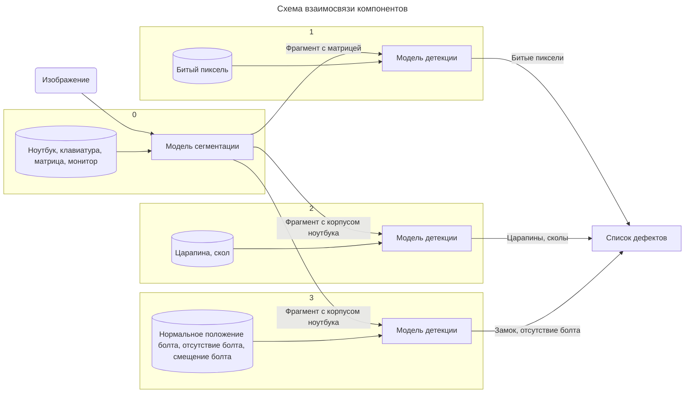

# Система обнаружения дефектов на ноутбуках
### Описание
Мы представляем веб-приложение для автоматического выявления и классификации дефектов на ноутбуках, основанное на передовых методах машинного обучения. Это решение позволяет быстро и эффективно оценивать качество оборудования, минимизируя время визуального осмотра и риск человеческой ошибки. Инженеры по качеству смогут легко загружать фотографии ноутбуков и получать подробные отчеты о найденных дефектах. Одной из ключевых особенностей нашего приложения является каскадное обучение, которое обеспечивает высокую точность детекции и возможность дообучения моделей без ухудшения результатов. 

Технологический стек: Python, YOLOv11, Gradio. Благодаря этому решению, специалисты смогут не только быстро находить дефекты, но и улучшать модели детекции на основе своих корректировок, что сделает процесс контроля качества более надежным и эффективным.

### Структура системы обнаружения дефектов 
Раздельное обучение позволяет гибко дообучать детекцию тех дефектов которые на данный момент система определяет хуже и хочется повысить качество без риска ухудшить показатели детекции других дефектов.Это достигается благодаря тому что нет смещения по классам при увеличении размера датасета.

Обучена модель для сегментации изображений. Данная модель выделяет области на изображении с ноутбуком, области с клавиатурой и монитором. Обучены три нейронных сети для детектирования: битых пикселей, царапин и сколов, проблем с винтами.

[comment]: <> (https://mermaid.js.org/syntax/flowchart.html)


### Необходимые библиотеки
```
gradio                   5.0.2
fpdf                     1.7.2
matplotlib               3.8.4
numpy                    1.26.4
pillow                   10.3.0
ultralytics              8.2.90
opencv-contrib-python    4.9.0.80
opencv-python            4.10.0.84

```

### Запуск 
```
python3 main.py
```
