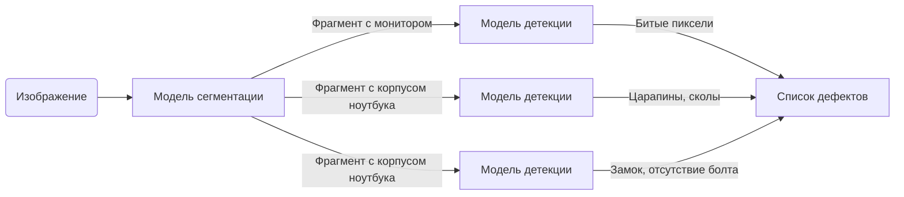

# hack2024

### Структура системы обнаружения дефектов 

```mermaid
graph LR
I(Изображение) --> A
A[Модель сегментации] -->|Фрагмент с монитором| B[Модель детекции]
A -->|Фрагмент с корпусом ноутбука| C[Модель детекции]
A -->|Фрагмент с корпусом ноутбука| D[Модель детекции]
B -->|Битые пиксели| E[Список дефектов]
C -->|Царапины, сколы| E
D -->|Замок, отсутствие болта| E

```
