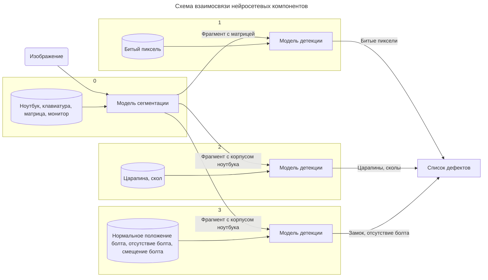
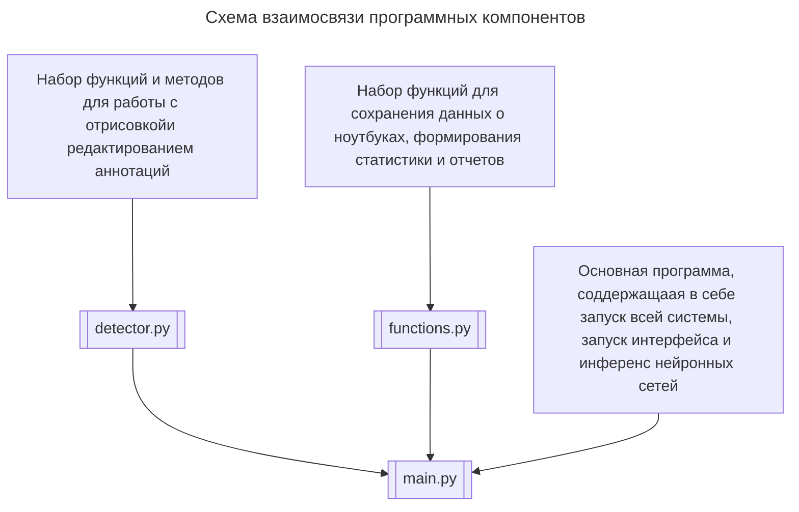

# Система обнаружения дефектов на ноутбуках
## <div align="center">Описание</div>
Мы представляем веб-приложение для автоматического выявления и классификации дефектов на ноутбуках, основанное на передовых методах машинного обучения. Это решение позволяет быстро и эффективно оценивать качество оборудования, минимизируя время визуального осмотра и риск человеческой ошибки. Инженеры по качеству смогут легко загружать фотографии ноутбуков и получать подробные отчеты о найденных дефектах. Одной из ключевых особенностей нашего приложения является каскадное обучение, которое обеспечивает высокую точность детекции и возможность дообучения моделей без ухудшения результатов. 

Технологический стек: Python, YOLO11, Gradio. Благодаря этому решению, специалисты смогут не только быстро находить дефекты, но и улучшать модели детекции на основе своих корректировок, что сделает процесс контроля качества более надежным и эффективным.

## <div align="center">Структура системы обнаружения дефектов</div>
  
Раздельное обучение позволяет гибко дообучать детекцию тех дефектов которые на данный момент система определяет хуже и хочется повысить качество без риска ухудшить показатели детекции других дефектов.Это достигается благодаря тому что нет смещения по классам при увеличении размера датасета.

Обучена модель для сегментации изображений. Данная модель выделяет области на изображении с ноутбуком, области с клавиатурой и монитором. Обучены три нейронных сети для детектирования: битых пикселей, царапин и сколов, проблем с винтами.

[comment]: <> (https://mermaid.js.org/syntax/flowchart.html)

Система имеет основной модуль 'main.py' и набор модулей, содержащих дополнительный функционал.


## <div align="center">Документация</div>
### Необходимые библиотеки
```
gradio                   5.0.2
fpdf                     1.7.2
matplotlib               3.8.4
numpy                    1.26.4
pillow                   10.3.0
ultralytics              8.2.90
opencv-contrib-python    4.9.0.80
opencv-python            4.10.0.84
```

Установка библиотек:
```
python3 -m pip install -r requirements.txt
```

### Пример обучения
```
yolo train model=yolo11n.pt data=coco8.yaml epochs=100 imgsz=640
```
[Сслыка на скачивание модели](https://disk.yandex.ru/d/mXzuGWWU0CEgjw)

### Запуск 
```
python3 main.py
```

## <div align="center">Скриншоты</div>
\

## <div align="center">Лицензия</div>
```
MIT License

Copyright (c) 2024 " or ""="

Permission is hereby granted, free of charge, to any person obtaining a copy
of this software and associated documentation files (the "Software"), to deal
in the Software without restriction, including without limitation the rights
to use, copy, modify, merge, publish, distribute, sublicense, and/or sell
copies of the Software, and to permit persons to whom the Software is
furnished to do so, subject to the following conditions:

The above copyright notice and this permission notice shall be included in all
copies or substantial portions of the Software.

THE SOFTWARE IS PROVIDED "AS IS", WITHOUT WARRANTY OF ANY KIND, EXPRESS OR
IMPLIED, INCLUDING BUT NOT LIMITED TO THE WARRANTIES OF MERCHANTABILITY,
FITNESS FOR A PARTICULAR PURPOSE AND NONINFRINGEMENT. IN NO EVENT SHALL THE
AUTHORS OR COPYRIGHT HOLDERS BE LIABLE FOR ANY CLAIM, DAMAGES OR OTHER
LIABILITY, WHETHER IN AN ACTION OF CONTRACT, TORT OR OTHERWISE, ARISING FROM,
OUT OF OR IN CONNECTION WITH THE SOFTWARE OR THE USE OR OTHER DEALINGS IN THE
SOFTWARE.
```
